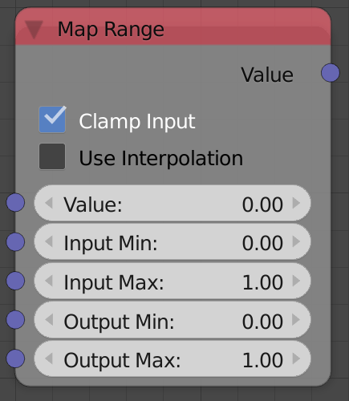
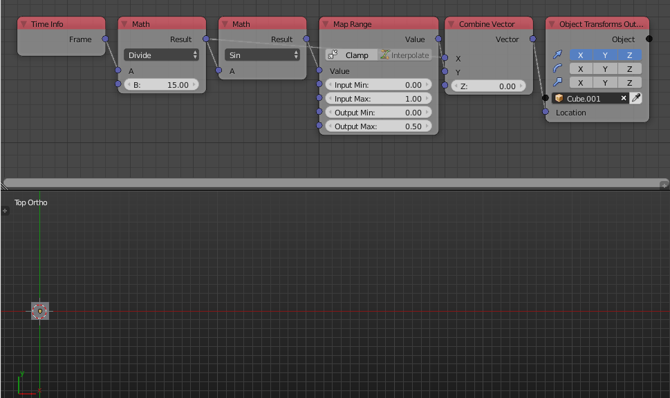

Map Range
=========

Description
-----------
This node remap a value from a defined interval to a new interval. 
Every value has a relative position in a specific interval, This node find a new value that match the relative position but in a new defined interval.

Inputs
------
 
- **Value** - A float that should to be remaped.
- **Input Min** - The start of the original interval.
- **Input Max** - The end of the original interval.
- **Output Min** - The start of the new interval.
- **Output Max** - The end of the new interval.

Outputs
-------

- **Value** - The value after remapping

Advanced Node Settings
----------------------

- N/A

Note
----

If the input value is outside the original interval, it will be remapped relative to the start and the end of the new interval.
That's why the node has an option to **Clamp Input**.

The node also support non linear interpolation, It means the value will not be remapped uniformly across the whole interval, **Custom Interpolations** will enable you to remape the input value based on its relative position in the original interval.
To be able to understand the **Custom Interpolation**, We reccomend you use the interval [0,1] for both the original and the new interval, then try using different interpolations and see how the output change as you change the value.

Warning
-------

**Custom Interpolation** will not work unless **Clamp Input** is enabled, because interpolation operate on normalized scales.

Examples of Usage
-----------------

