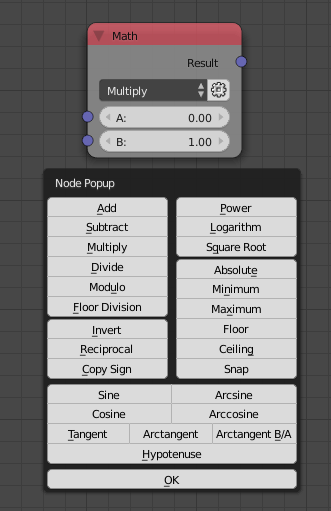

Math
====

Description
-----------

This node performs 26 math operations:

- **Add** - Adds input A to input B.
- **Subtract** - Subtract input B from input A.
- **Multiply** - Multiplies input A by input B.
- **Divide** - Divides input A by input B.
- **Sine** - Calculate the sine of input A.
- **Cosine** - Claculate the cosine of input A.
- **Tangent** - Calculate the tangent of input A.
- **Arcsine** - Calaculate the arcsine of input A.
- **Arccosine** - Calculate the arccosine of input A.
- **Arctangent** - Calculate the arctangent of input A.
- **Power** - Returns input A to the power of input B.
- **Logarithm** - Returns the logarithm of input A to the base input B.
- **Minimum** - Returns the smallest value from input A and input B.
- **Maximum** - Returns the largest value from input A and input B.
- **Modulo** - Returns the remainder of divinding input A by input B.
- **Absolute** - Returns the positive value of input A.
- **Floor** - Returns the whole number of input A.
- **Ceiling** - Returns the next whole number after input A.
- **Square Root** - Returns the square root of input A.
- **Invert** - Flips the sign of input A.
- **Reciprocal** - Returns the mathematical inverse of input A (1/A).
- **Snap** - Snaps input A to the whole multiples of the Step Size.
- **Arctangent B/A** - Returns the arctangent of input B divided by input A.
- **Hypotenuse** - Returns the length of the hypotenuse given the side length input A and B.
- **Copy Sign** - Returns input A with the sign of input B.
- **Floor Division** - Returns the whole number of input A divided by input B.

Inputs
------

- **A** - Input A.
- **B** - Input B.

(Inputs are dynamic, Means the node has either one or two inputs based on selected operation.)

Outputs
-------

- **Result** - The result of the math operation.

Advanced Node Settings
----------------------

- **Remove Quick Settings** - You may notice that when duplicating a math node, couple of buttons appear along with a green check mark. Those are called **Quick Settings**, clicking on one of the buttons change the type of the math node to the type of the button. The check mark is a way to tell AN that the current type is what you want and that you no longer need the menu. This button in the advanced node settings click the check mark for all math nodes in the node tree.

Notes
-----

- Division by 0 returns 0.0.
- Logarithm with the base <=0 or =1 takes the natural logarithm.
- Modulo by 0 returns 0.0.
