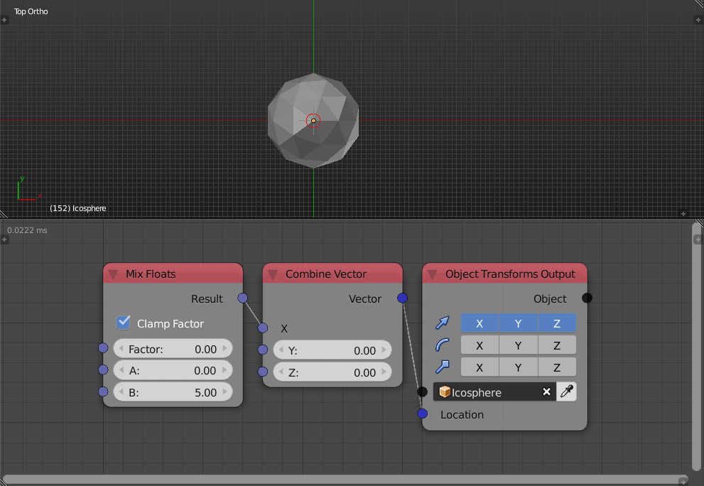

Mix floats
==========

Description
-----------

This node linearly mixes between two floats based on a factor.

.. image:: images/mix_floats_node.png
   :width: 160pt

Options
-------

- **Clamp** - If enabled, a factor that is larger than one will be rendered one and a factor that is less than zero will be rendered zero.

Inputs
------

- **Factor** - A float that controls the amount of each float input to the output, Where 0 means the first float only and 1 means the second float only.

Outputs
-------

- **Result** - The result of mixing the two floats by the factor.

Advanced Node Settings
----------------------

- N/A

Note
----

By how the *Mix floats* works, a factor that is larger than 1 won't be clamped but rather multiplied to the second float that's why the node has an option to *Clamp Factor*.

Examples of Usage
-----------------

