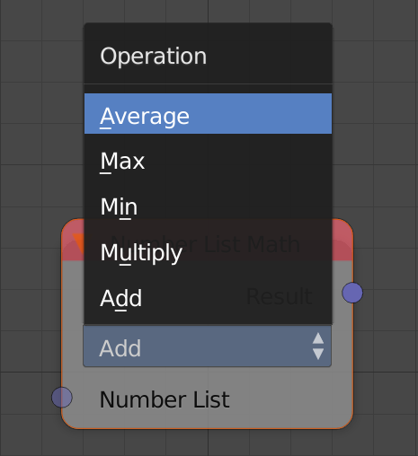
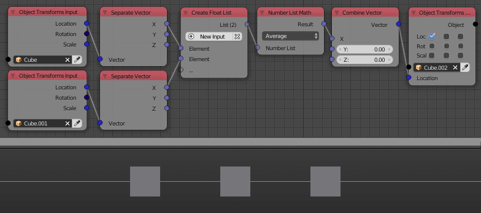

Number List Math
================

Description
-----------

This node performs 5 math operations on float and integer lists:

- **Add** - Adds all the elements of the list.
- **Multiply** - Multiplies all the elements on the list.
- **Min** - Returns the smallest number in the list.
- **Max** - Returns the largest number in the list.
- **Average** - Returns the average of all the elements of the list.

Inputs
------

- **Number list** - A number list, can be integer or float.

Outputs
-------

- **Result** - The result of the math operation.

Advanced Node Settings
----------------------

N/A

Examples of Usage
-----------------

