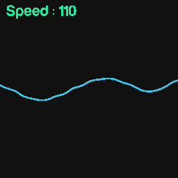
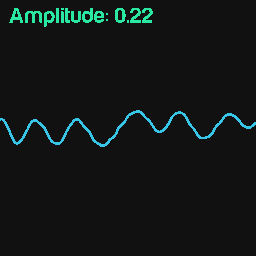
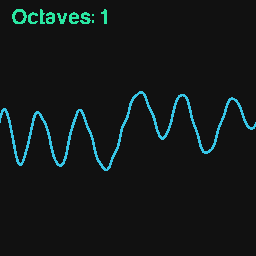
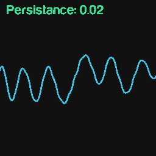
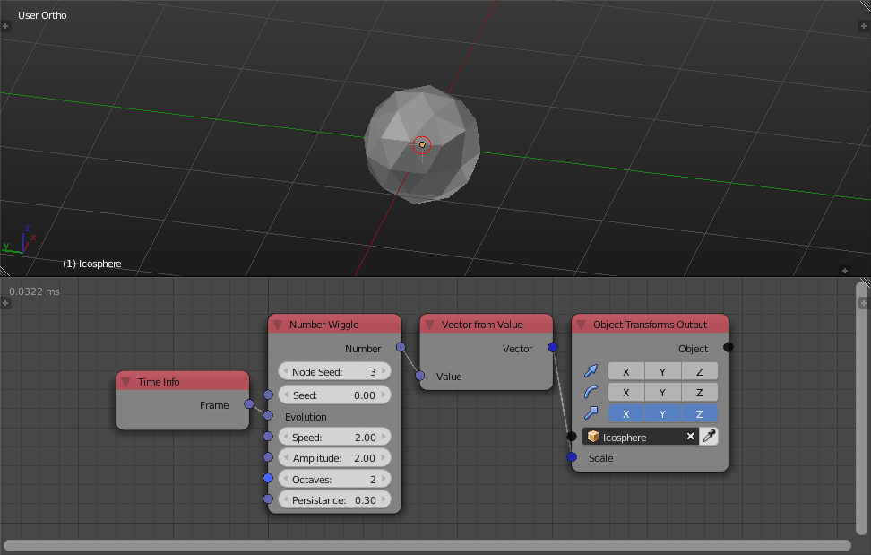

.. _number-wiggle:

Number Wiggle
=============

Description
-----------

This node is a 1D noise generator, you can think of it as random numbers that are smoothly connected to each other.

It is a function of variable **Evolution**, which means every value of the variable **Evolution** has a corresponding value calculated based on the node options and this value is the output of the node.

.. image:: images/number_wiggle_node.png
   :width: 160pt

Options
-------

- **Node Seed** - Aside from the *Seed input*, this extra seed parameter enables you to get different random numbers if the *Seed input* in not free, that is, it is dependent on some property that you can't freely controle, for instance, when using multiple *Random Number* nodes in a loop while using the index as a seed, you can change the node seed to get different numbers for each node. Animation Nodes automatically changes the *Node Seed* when you duplicate or add a new *Random Number* node.

Inputs
------

- **Seed** - Seed for the random generator, where different seed generate different vectors.
- **Evolution** - A float at which the noise is evaluated.
- **Speed** - It is the frequency of the noise or the rate of change of the values.
- **Amplitude** - It is the maximum possible value for the absolute of the output number.
- **Octaves** - It is the number of perlin noises that constructs the noise function, where the noise function is the superposition of `n` number of perlin noise with different frequencies where `n` is the Octaves input.
- **Persistance** - The magnitude of the added higher frequency octaves, the magnitude of each octave is directly propertional to its frequency.

Outputs
-------

- **Number** - The output of the noise function at the variable **Evolution**.

Advanced Node Settings
----------------------

- N/A

Examples of Usage
-----------------

