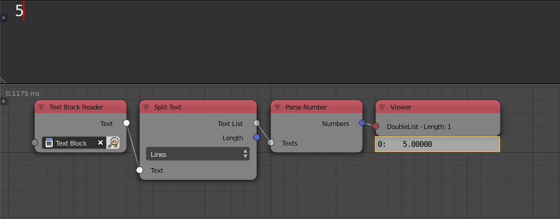

Parse Number
============

Description
-----------

This node is used to convert a text that include numbers into a float data type.

.. image:: images/parse_number_node.png
   :width: 160pt

Inputs
------

- **Text** - The string that should be converted into float.

Outputs
-------
- **Number** - The float that was extracted from the input text.

Advanced Node Settings
----------------------

- N/A

Caution
-------

The input text should only include numbers, otherwise the node will return a parsing error. White spaces around single numbers are rejected, for instance, ``(spaces)5(spaces)`` will be parsed but ``(spaces)5(spaces)4(spaces)`` will not be parsed because there are two numbers.

Examples of Usage
-----------------

