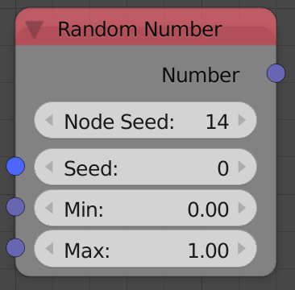
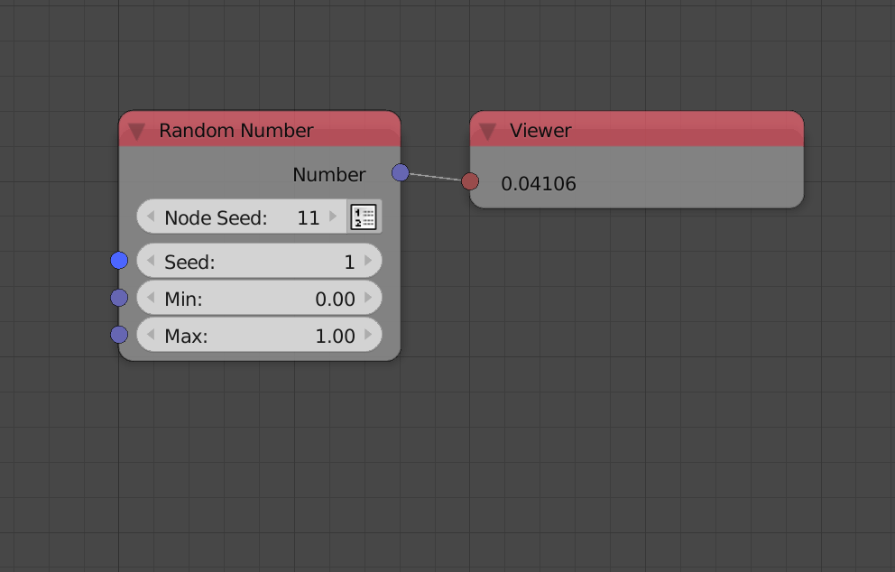

Random Number
=============

Description
-----------

This node generates a random float between a minimum and a maximum value.

Options
-------

- **Node Seed** - Aside from the *Seed input*, this extra seed parameter enables you to get different random numbers if the *Seed input* in not free, that is, it is dependent on some property that you can't freely controle, for instance, when using multiple *Random Number* nodes in a loop while using the index as a seed, you can change the node seed to get different numbers for each node. Animation Nodes automatically changes the *Node Seed* when you duplicate or add a new *Random Number* node.
- **Create List** - It is the button you see beside the *Node Seed*, if enabled, the output will be a list of random floats.

Inputs
------

- **Seed** - Seed for the random generator, Where different seed generate different random number.
- **Min** - A float value that the generated number won't deceed.
- **Max** - A float value that the generated number won't exceed.
- **Count** - The number of random floats to generate. (Only available if *Create List* is enabled)

Outputs
-------

- **Number** - A random float between the minimum and the maximum value.

Advanced Node Settings
----------------------

- N/A

Examples of Usage
-----------------

.. image:: gifs/random_number_node_example2.gif
.. image:: gifs/random_number_node_example3.gif
