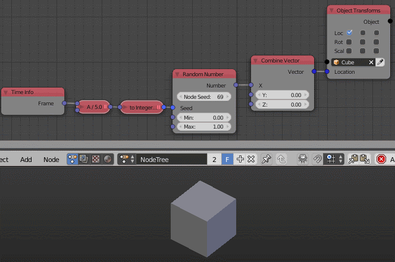

Random Number
=============

Description
-----------

This node generates a random float between a minimum and a maximum value.

.. image:: images/random_number_node.png
   :width: 160pt

Inputs
------

- **Seed** - Seed for the random generator, Where different seed generate different random number.
- **Min** - A float value that the generated number won't deceed.
- **Max** - A float value that the generated number won't exceed.

Outputs
-------

- **Number** - A random float between the minimum and the maximum value.

Advanced Node Settings
----------------------

- N/A

Note
----

The node has an **extra seed** (*Node Seed*) that can be used to differentiate between nodes with the same seed, e.g., When using multiple *Random Number* nodes in a loop while using the index as a seed, you can change the extra seed to get different results from the other nodes.

Animation Nodes automatically change the *Node Seed* when you duplicate or add a new *Random Number* node.

Examples of Usage
-----------------

