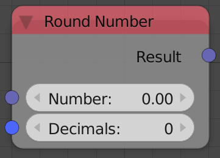
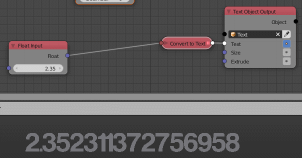

Round Number
============

Description
-----------
This node round floats to a defined number of decimals.

Inputs
------
 
- **Number** - A float to be rounded.

Outputs
-------

- **Result** - Rounded number.

Advanced Node Settings
----------------------

N/A

Examples of Usage
-----------------

