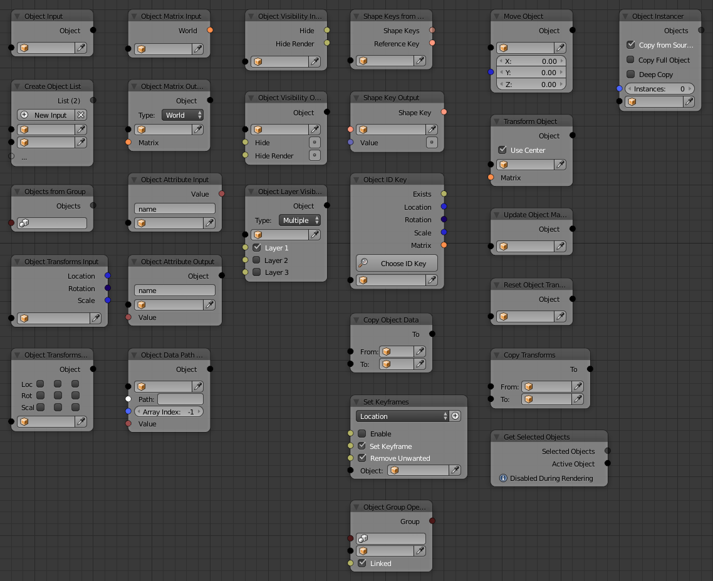

Object
======

.. toctree::
   :maxdepth: 2
   
   Object <object>
   List <list>
   From Group <from_group>
   Transforms Input <transforms_input>
   Transforms Output <transforms_output>
   Matrix Input <matrix_input>
   Matrix Output <matrix_output>
   Attribute Input <attribute_input>
   Attribute Output <attribute_output>
   Data Path Output <data_path_output>
   Visibility Input <visibility_input>
   Visibility Output <visibility_output>
   Layer Visibility Output <layer_visibility_output>
   ID Key <id_key>
   Copy Data <copy_data>
   Set Keyframes <set_keyframes>
   Utils <utils/index>
   Instancer <instancer>

