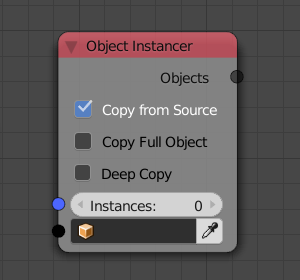

Instancer
=========

The instancer node is one of the most important nodes in AN. It allows
you to create replicates of existing objects or completely new objects.

Limitations:
    * The node is not allowed to be in a subprogram
