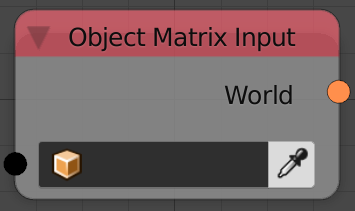

Object Matrix Input
===================

Description
-----------
This node return the transformation matrix of the input object.

Inputs
------

- **Object** - An object.

Outputs
-------

- **World** - World space transformation matrix.
- **Basis** - World space transformation matrix but without constraints and parentings.
- **Local** - Local space transformation matrix.
- **Parent Inverse** - Inverse of object’s parent matrix at time of parenting.

Advanced Node Settings
----------------------

- N/A

Examples of Usage
-----------------

.. image:: gifs/object_matrix_input_node_example.gif
