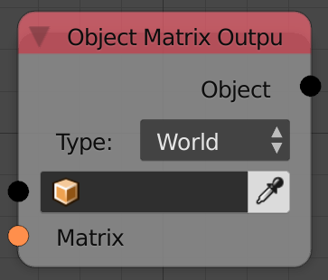
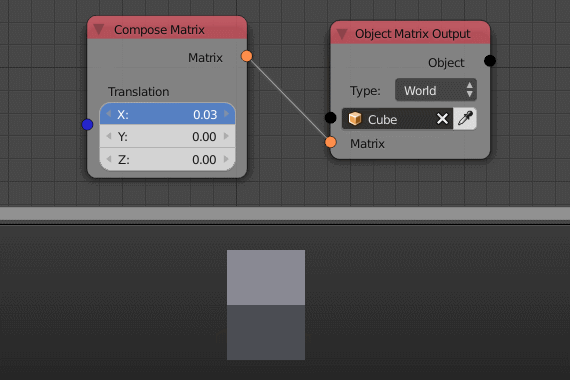

Object Matrix Output
====================

Description
-----------
This node set the transformations of the input object to the input transformation matrix.

Inputs
------

- **Object** - An object.
- **Matrix** - An input transformation matrix.

Outputs
-------

- **Object** - The input object.

Advanced Node Settings
----------------------

- **Type** - This option will let you choose the type of the transformation applied including: World, Local, Basis and Parent Inverse.

Examples of Usage
-----------------

