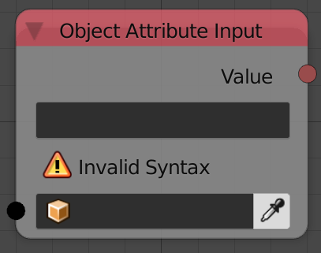
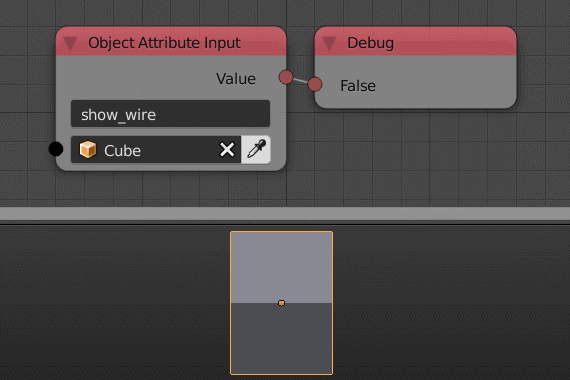

Object Attribute Input
======================

Description
-----------
This node returns a specific object property based on the input Data Path of the property.
To get the data path of any property just right click on the property and select **Copy Data Path**

Inputs
------

- **Object** - An object.

Outputs
-------

- **Value** - The output value.

Advanced Node Settings
----------------------

- N/A

Examples of Usage
-----------------

