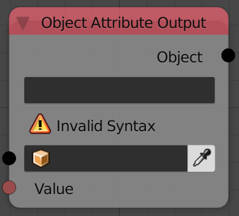
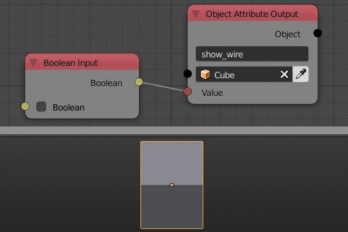

Object Attribute Output
=======================

Description
-----------
This node sets the choosen property to the input value.
To get the data path of any property just right click on the property and select **Copy Data Path**.

Inputs
------

- **Object** - An object.
- **Value** - The value of the property.

Outputs
-------

- **Object** - The input object.

Advanced Node Settings
----------------------

- N/A

Examples of Usage
-----------------

