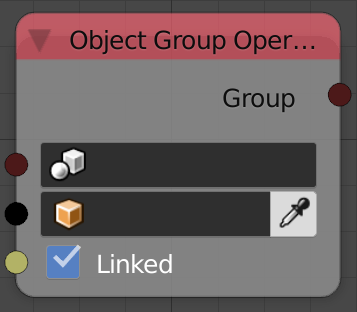
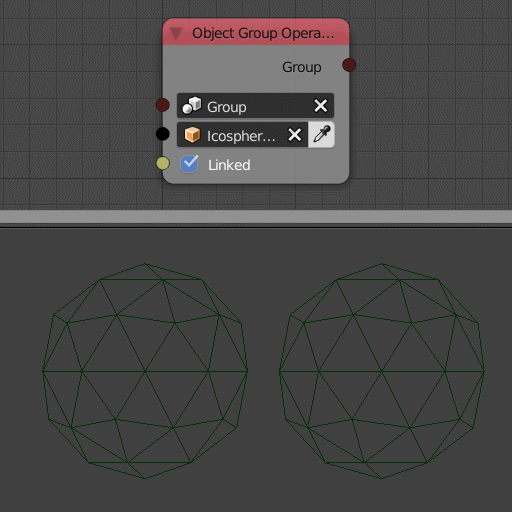

Object Group Operations
=======================

Description
-----------
This node adds or removes objects from input object group.

Inputs
------

- **Group** - Reference object group.
- **Object** - An object to remove or add to the group.
- **Linked** - Link (Add) object to group if true and unlink (remove) if not.

Outputs
-------

- **Group** - The input object group.

Advanced Node Settings
----------------------

- N/A

Examples of Usage
-----------------

