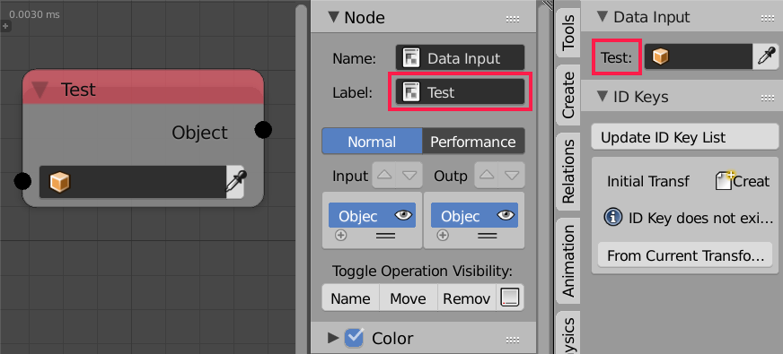

Object Input
============

Description
-----------

This node output the input object.

Clicking the eye dropper icon will set the input object to the active object in the 3d viewport.

.. image:: images/object_input_node.png
   :width: 160pt

Advanced Node Settings
----------------------

- **Show in viewport** - If this option is enabled, an object selector will show up in the *Data Input* panel in the *AN* tabe in the *Tool Shelf*. The name of that selector will copy the node label if it is set. This option is useful if one want to edit some parameters in the node tree directly from within the 3d viewport without having to go the node editor.

