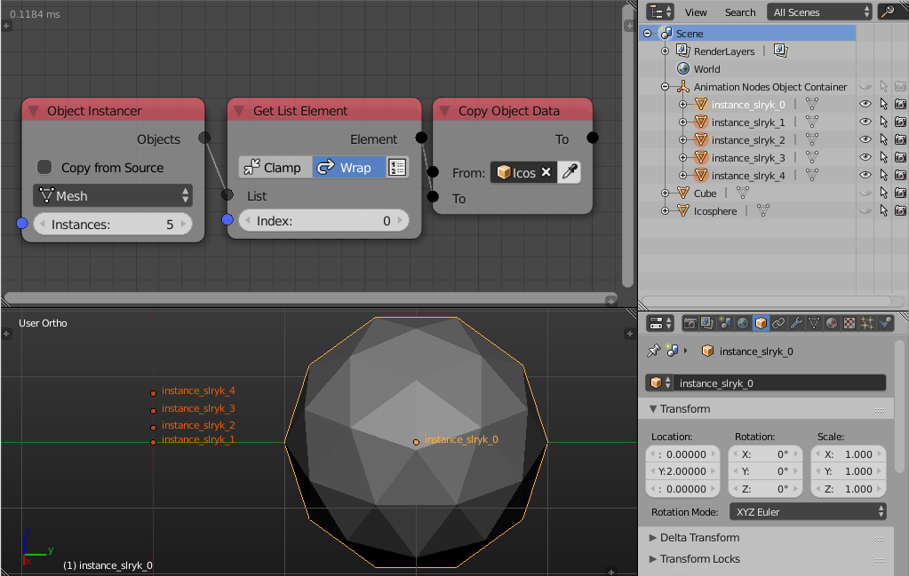
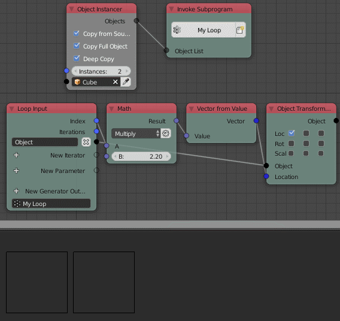

Object Instancer
================

Description
-----------
This node dynamically creates and duplicates objects.

.. image:: images/object_instancer_node.png
   :width: 160pt

Options
-------

- **Copy from source** - This option is enabled by default and it let you instance an object with its data, however, if the option is disabled, the node will create objects with empty data blocks which you can then fill and control by other nodes like the *Copy Object Data Node* or the *Object Output Node*.
- **Object Type** - This option is only visible when *copy from source* is disabled. It lets you define the type of data block the object should carry, so the data can be *Mesh*, *Curve*, *Lamp*, etc.

This example sum the last 2 options:

I used the object instancer node to create 5 objects with empty mesh data, I then used a *Copy Data Node* to copy the mesh data from a cube to the first instance, however I didn't edit or fill the mesh data of any of the other 4 object so they are objects without any data and just act as an empty (An empty is just a location, rotation, and scale). Another node that can fill in the mesh data of an object is the *Object Output Node*.

- **Copy full object** - If enabled will copy the modifiers and the constraints with the object. (Only available when Copy From Source is enabled)
- **Deep copy** - If enabled will copy mesh data as well so that every data block has a single user. The new object will be independent of the source. (Only available when Copy From Source is enabled)

Inputs
------

- **Instances** - The number of instances created of the object.
- **Object** - The input object to instance. (Only available when Copy From Source is enabled)

Outputs
-------

- **Objects** - A list that contains the instanced objects.

Advanced Node Settings
----------------------

- **Parent to Main Container** - Parent the resulted objects to AN main container.
- **Remove Animation Data** - Clear the animation data of the newly created objects.
- **Reset Source Data** - This will reset the source data for all instances.
- **Unlink instances from node** - This will separate the instances from the node to make sure they don't get removed when you removed the node.
- **Hide relationship lines** - This will hide the lines going to the container in the viewport.

Examples of Usage
-----------------

