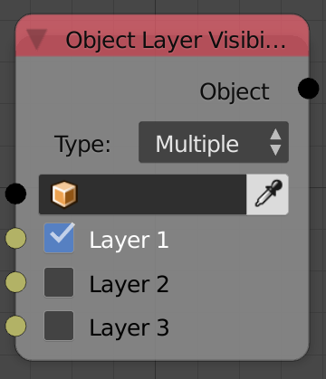
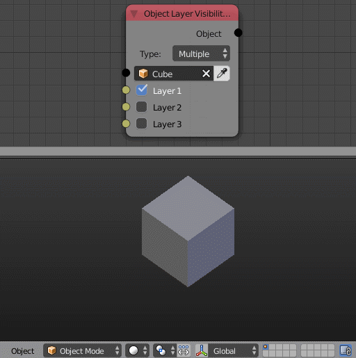

Object Layer Visibility Output
==============================

Description
-----------
This node let you move objects through blender's layers system.

Inputs
------

- **Object** - An object.
- **Layer 1** - A boolean if True, the object will be included in the layer 1.
- **Layer 2** - A boolean if True, the object will be included in the layer 2.
- **Layer 3** - ...

Outputs
-------

- **Object** - The input object.

Advanced Node Settings
----------------------

- N/A

Examples of Usage
-----------------

