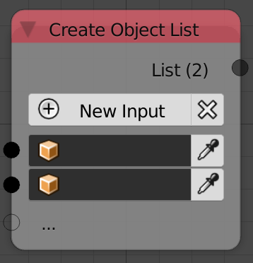
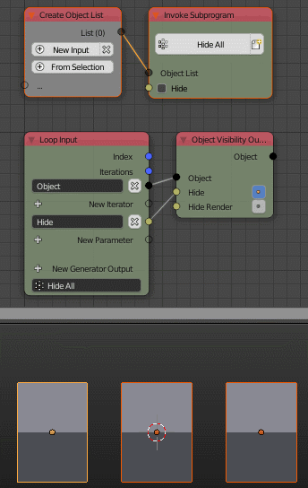

Object List
===========

Description
-----------

This node is used to create an arbitrary list of objects. A new object can be added with the *New Input* button. A new object can also be added by plugging it into the transparent socket.

Inputs
------

- **Object** - An object at the index 0.
- **Object** - An object at the index 1.
- **Object** - ...

Outputs
-------
- **Object list** - A list that contain all the input objects.

Advanced Node Settings
----------------------

- **Change type** - Changes the type of the object list to another list type.
- **Hide Inputs** - Hides all the inputs in the node.
- **Remove Unlinked Inputs** - Removes all the inputs that are not connected to another node.

Caution
-------

A warning will pop up when you use the *Remove Unlinked Inputs* button in the node, while if you used the the *Remove Unlinked Inputs* button in the *Advanced Node Settings* the inputs will be removed without a warning.

Examples of Usage
-----------------

