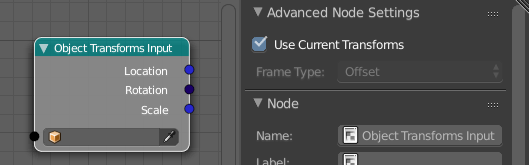

Object Transforms Input
=======================

This node has 3 output sockets. The *Location* and *Scale* output have ``Vector``
as data type while *Rotation* is an ``Euler`` value.

In the advanced panel is an option to the current frame or not. If unchecked
you can get the transformation of the object at a different point in time.

Limitations:
    - The rotation output only gives the correct result when the rotation mode
      for the given object is Euler.
    - The given transformation is not correct when the object is somehow parented
      to another object because it will only give you the local transformation.
      If that is not what you need, take a look at the "Object Matrix Input" node.
      The limitation there is that you cannot get the transformation at another frame.
