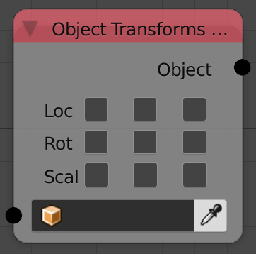
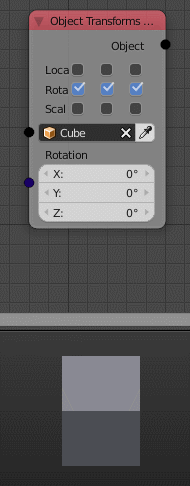

Object Transforms Output
========================

Description
-----------
This node sets the location, rotation, and scale of the input object to the input transformations.

To output a property, enable its representative check box.

Inputs
------

- **Object** - An object.
- **Location** - A vector that contains the location of the object.
- **Rotation** - An euler that contains the rotation of the object.
- **Scale** - A vector that contains the scale of the object.

Outputs
-------

- **Object** - The input object.

Advanced Node Settings
----------------------

- N/A

Examples of Usage
-----------------

