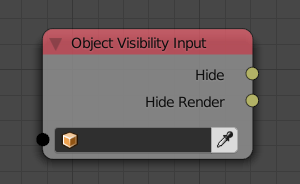
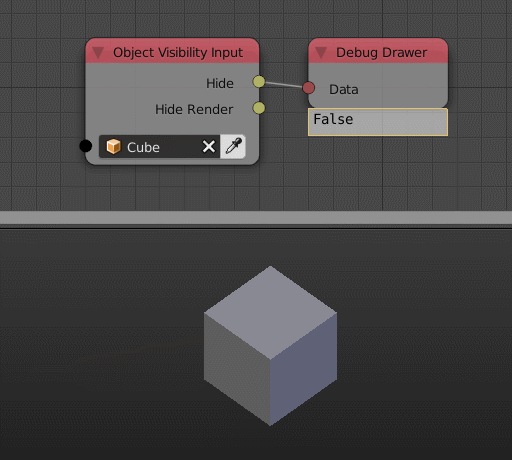

Object Visibility Input
=======================

Description
-----------
This node will return a boolean which describe the visibility of some properties such as the object's visibility in viewport of rendering.

Inputs
------

- **Object** - An object.

Outputs
-------

- **Hide** - Returns True if object is visible in viewport and False if not.
- **Hide Select** - Returns True if object is selectable in viewport and False if not.
- **Hide Render** - Returns True if object is visible in rendering and False if not.
- **Show Name** - Returns True if object's name is visible and False if not.
- **Show Axis** - Returns True if object's axis is visible and False if not.
- **Show X-Ray** - Returns True if object xray is enabled and False if not.

Advanced Node Settings
----------------------

- N/A

Examples of Usage
-----------------

