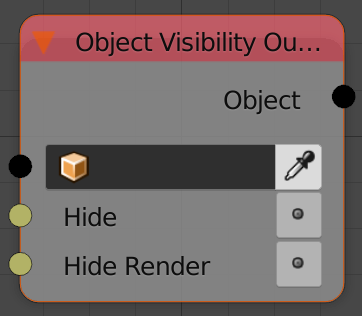
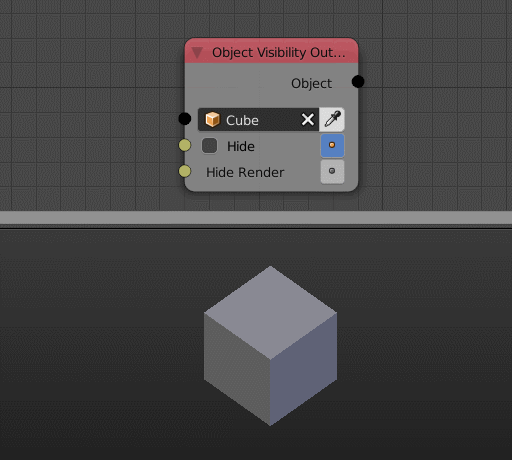

Object Visibility Output
========================

Description
-----------
This node let you set the visibility of multiple object's properties.

Inputs
------

- **Object** - An object.
- **Hide** - A boolean to hide the object.
- **Hide Select** - A boolean to make the object unselectable.
- **Hide Render** - A boolean to hide the object while rendering.
- **Show Name** - A boolean to show the object name.
- **Show Axis** - A boolean to show the object's axis.
- **Show X-Ray** - A boolean to enable Xray.

Outputs
-------

- **Object** - The input object.

Advanced Node Settings
----------------------

- N/A

Examples of Usage
-----------------

