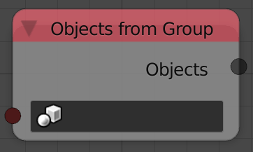
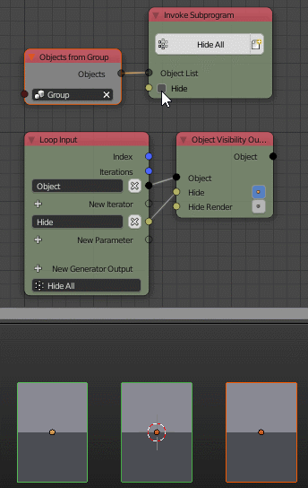

Objects From Group
==================

Description
-----------

This node returns a list of objects that are included in the input object group.

Inputs
------

- **Object Group** - An object group.

Outputs
-------

- **Objects** - A list that contains all the objects in the input object group.

Advanced Node Settings
----------------------

- N/A

Examples of Usage
-----------------

