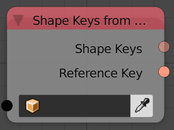
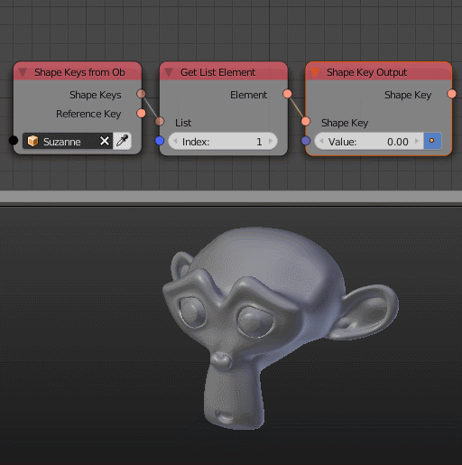

Shape Keys From Object
======================

Description
-----------
This node returns a list of shape keys in the input object, Those outputs can then be used in The Shape Key Output node.

Inputs
------

- **Object** - An object.

Outputs
-------

- **Shape Keys** - A list of all shape keys in the input object.
- **Reference Key** - The basis shape key.

Advanced Node Settings
----------------------

- N/A

Examples of Usage
-----------------

