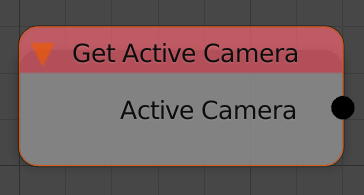

Get Active Camera
=================

Description
-----------

This node will return the active camera in the scene.

Inputs
------

- N/A

Outputs
-------

- **Active Camera** - The active camera.

Advanced Node Settings
----------------------

- N/A
