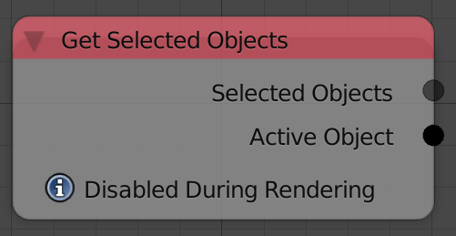
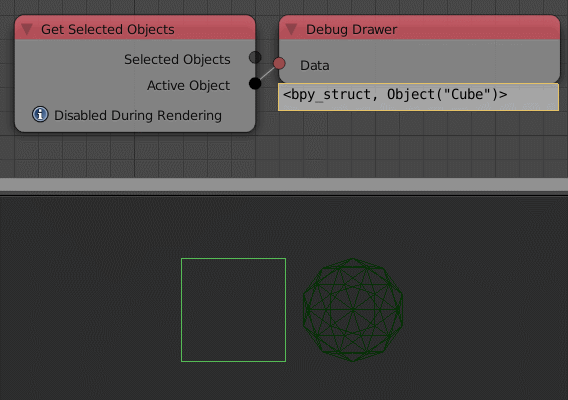

Get Selected Objects
====================

Description
-----------
This node will return the Active object and a list of the selected objects.

Inputs
------

- N/A

Outputs
-------

- **Selected Objects** - A list of the selected objects.
- **Active Object** - The active object.

Advanced Node Settings
----------------------

- N/A

Examples of Usage
-----------------

