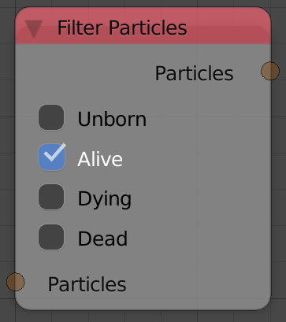
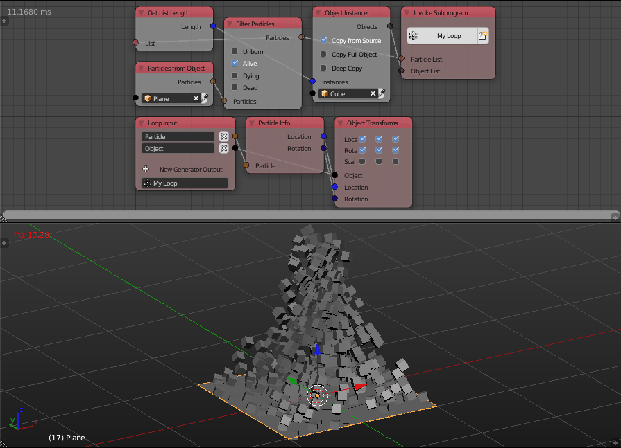

Filter Particles
================

Description
-----------
This node takes a particle list and returns particles of only a specific state.

Options
-------

- **Unborn** - This option if enabled will include particles that weren't born yet in the output particle list.
- **Alive** - This option if enabled will include particles that are born and still alive in the output particle list.
- **Dying** - This option if enabled will include particles that are dying in the output particle list.
- **Dead** - This option if enabled will include particles that died in the output particle list.

Inputs
------

- **Particles** - A list of particles.

Outputs
-------

- **Particles** - A list of the filtered particles.

Advanced Node Settings
----------------------

- N/A

Examples of Usage
-----------------

