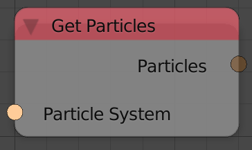

Get Particles
=============

Description
-----------
This node returns a particle list that contains the particles in the input particle system.

Inputs
------

- **Particle System** - A particle system to return its particles.

Outputs
-------

- **Particles** - A list of all particles in the input particle system.

Advanced Node Settings
----------------------

- N/A

Examples of Usage
-----------------

.. image:: gifs/particle_system_input_node_example.gif
