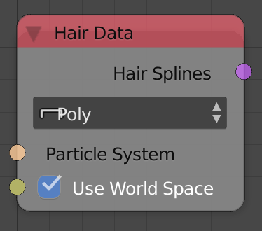

Hair Data
=========

Description
-----------

This node converts hairs of the input particle system into splines.

Options
-------

- **Bezier** - Creates bezier splines.
- **Poly** - Creates poly splines.

Inputs
------

- **Particle System** - A particle system.
- **Use World Space** - If True, splines will be in world space.

Outputs
-------

- **Hair Splines** - A spline list that contains splines that were generated from the hair of the particle system.

Advanced Node Settings
----------------------

N/A

Examples of Usage
-----------------

.. image:: gifs/hair_data_node_example.gif
