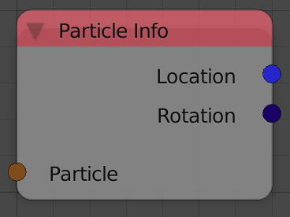

Particle Info
=============

Description
-----------
This node takes a particle and returns some information about it.

Inputs
------

- **Particle** - A particle.

Outputs
-------

- **Location** - A vector that represents the location of the particle.
- **Rotation** - An euler that represents the orientation of the particle.(Check *Rotation* panel in the particle system tab)
- **Velocity** - A vector that represents the velocity of the particle.
- **Angular Velocity** - An euler that represents the angular veclocity of the particle.(Check *Rotation* panel in the particle system tab)
- **Size** - A float that represents the size of the particle.
- **Alive State** - A string that tells the state of the particle---If it is dead, alive, dying, or not born yet.
- **Is Exist** - A boolean that is true if the particle exist.
- **Is Visible** - A boolean that is true if the particle is visible in the viewport(according to the render option of the particle in the *Render panel*).
- **Life Time** - A float that represents the life time of the particle which is usually constant unless *Random Life Time* is checked.
- **Birth Time** - A float that represents the time at which the particle was born.
- **Die Time** - A float that represents the time at which the particle died.
- **Previouse Location** - A vector that represents the location of the particle at the previouse frame.
- **Previouse Rotation** - An euler that represents the orientation of the particle at the previouse frame.
- **Previouse Velocity** - A vector that represents the velocity of the particle at the previouse frame.
- **Previouse Angular Vecolity** - An euler that represents the angular velocity of the particle at the previouse frame.
- **Hair Times** - `To Do` Possibly the 1D location of the hair points in the range of 100.
- **Hair Weights** - A float list that contains the weights of points of the particle(hair strand).
- **Hair Points** - A vector list that contains the locations of the particle(hair strand) points in world space.
- **Hair Points Locals** - A vector list that contains the locations of the particle(hair strand) points in local space---Local relative to the origin of the hair strand.

Advanced Node Settings
----------------------

- N/A

Examples of Usage
-----------------

.. image:: gifs/particles_from_object_node_example.gif
