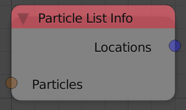
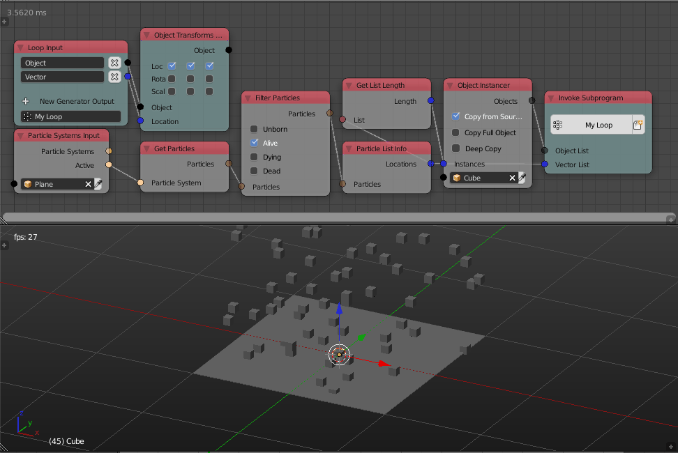

Particle List Info
==================

Description
-----------
This node returns different lists of different information about input particles like its locations,velocities and sizes.

Inputs
------

- **Particles** - A list of particles.

Outputs
-------

- **Locations** - A vector list that contains the locations of the input particles.
- **Velocities** - A vector list that contains the velocities of the input particles.
- **Sizes** - A float list that contains the sizes of the input particles.
- **Birth Time** - A float list that contains the times at which input particles were born.
- **Die Time** - A float list that contains the times at which input particles died.

Advanced Node Settings
----------------------

- N/A

Examples of Usage
-----------------

