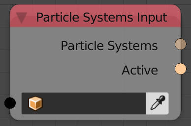

Particle System Input
=====================

Description
-----------
This node returns all the particle systems in the input object as well as the active one.

Inputs
------

- **Object** - An object to return its particle systems.

Outputs
-------

- **Particle Systems** - A list of all particle systems in the input object.
- **Active** - The active particle system in the input object---The selected one.

Advanced Node Settings
----------------------

- N/A

Examples of Usage
-----------------

.. image:: gifs/particle_system_input_node_example.gif
