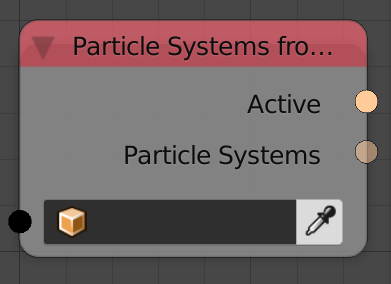

Particle Systems From Object
============================

Description
-----------

This node return a list of particle systems in the input object along with the active (selected) one.

Inputs
------

- **Object** - An object.

Outputs
-------

- **Active** - The active particle system in the input object.
- **Particle Systems** - A list of particle systems in the object.

Advanced Node Settings
----------------------

N/A

Examples of Usage
-----------------

.. image:: gifs/particles_data_node_example.gif
