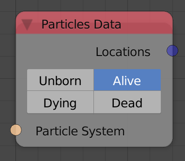

Particles Data
==============

Description
-----------

This node return some info about particles of the input particle system.

Options
-------

- **Unborn** - Include particles that are not born yet.
- **Alive** - Include particles that are alive.
- **Dying** - Include particles that are dying.
- **Dead** - Include particles that are dead.

Inputs
------

- **Particle System** - A particle system.

Outputs
-------

- **Locations** - A vector list that contains the locations of the particles of the input particle system.
- **Velocities** - A vector list that contains the velocities of the particles of the input particle system.
- **Sizes** - A float list that contains the sizes of the particles of the input particle system.
- **Birth times** - A float list that contains the times at which particles of the input particle system were born.
- **Die times** - A float list that contains the times at which particles of the input particle system died.

Advanced Node Settings
----------------------

N/A

Examples of Usage
-----------------

.. image:: gifs/particles_data_node_example.gif
