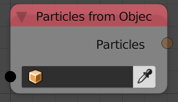

Particles From Object
=====================

Description
-----------
This node returns a particle list that contain all the particles in all the particle systems in the input object.

Inputs
------

- **Object** - An object to return all its particles.

Outputs
-------

- **Particles** - A list of all the particles in all the particle systems in the input object.

Advanced Node Settings
----------------------

- N/A

Examples of Usage
-----------------

.. image:: gifs/particles_from_object_node_example.gif
