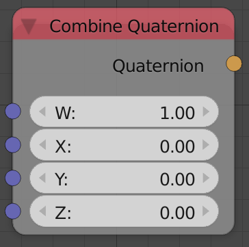
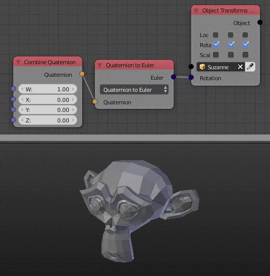

Combine Quaternion
==================

Description
-----------
This node composes a quaternion from W,X,Y,Z components.

Inputs
------

- **W** - The W component of the output quaternion.
- **X** - The X component of the output quaternion.
- **Y** - The Y component of the output quaternion.
- **Z** - The Z component of the output quaternion.

Outputs
-------

- **Quaternion** - A quaternion composed of inputs W,X,Y,Z.

Advanced Node Settings
----------------------

N/A

Examples of Usage
-----------------

