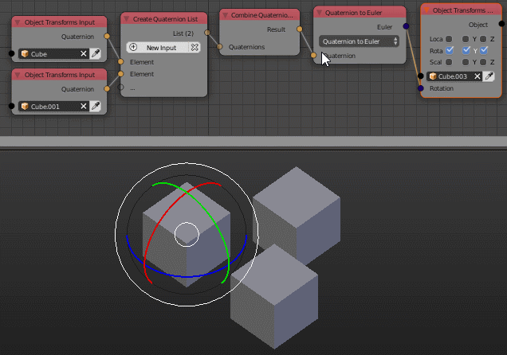

Combine Quaternion Rotations
============================

Description
-----------

This node takes a list of quaternions and rotates the first quaternion by the next quaternion in the list till the end and the result is output as a quaternion.

.. image:: images/combine_quaternion_rotations_node.png
   :width: 160pt

Inputs
------

- **Quaternion List** - A list that contain the rotation quaternions.

Outputs
-------

- **Quaternion** - The rotated quaternion.

Advanced Node Settings
----------------------

- N/A

Note
----

Quaternion rotation is not commutative, so the order of quaternions in the list matters.

Examples of Usage
-----------------

