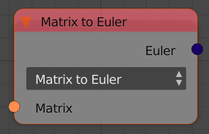
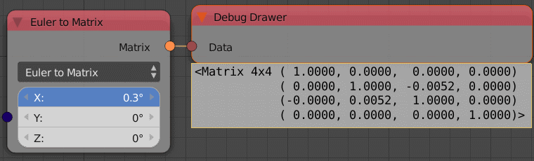

Convert Rotation Types
======================

Description
-----------

This node converts from a rotation type to another. It supports :

- Quaternion to Euler.
- Euler to Quaternion.
- Quaternion to Matrix.
- Matrix to Quaternion.
- Euler to Matrix.
- Matrix to Euler.
- Quaternion to Axis Angle.
- Axis Angle to Quaternion.

Inputs
------

Inputs are defined based on the conversion type.

Outputs
-------

Outputs are defined based on the conversion type.

Advanced Node Settings
----------------------

- N/A

Examples of Usage
-----------------

