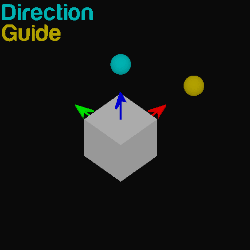
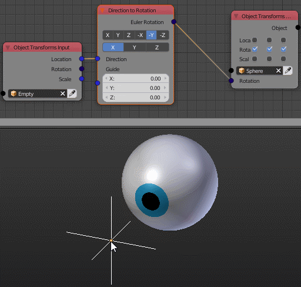

Direction To Rotation
=====================

Description
-----------
This node convert a direction to a rotation, A vector that define a direction is input and a corresponding rotation is output.

.. image:: images/direction_to_rotation_node.png
   :width: 160pt

Demonstration
-------------
To better understand how this node work, You can think of it as aligning the local **Track Axis** of the object to the input **Direction Vector**.

It is true that the selected local **Track Axis** is locked to the input direction vector, but that means the object can still rotate around that vector while maintaining its direction, This node enable you to guid the object rotation around that axis using another vector, **Guide Vector** and **Guide Axis**.

You can also think of the guiding feature as alighning the local **Guide Axis** of the object to the input **Guide Vector**.

Here is an example where the **Track Axis** is set to Z and the **Guide Axis** is set to X.

Inputs
------
 
- **Direction** - The vector that define the direction, Can be normalized or not.
- **Guide** - The vector that define the rotation around the **Direction Vector**.

Outputs
-------

- **Euler Rotation** - The resulted rotation in a form of Euler Rotation.

Advanced Node Settings
----------------------

- N/A

Warning
-------

- The **Track Axis** can never be the **Guide Axis** because The **Track Axis** is already locked to the **Direction Vector**.

Examples of Usage
-----------------

