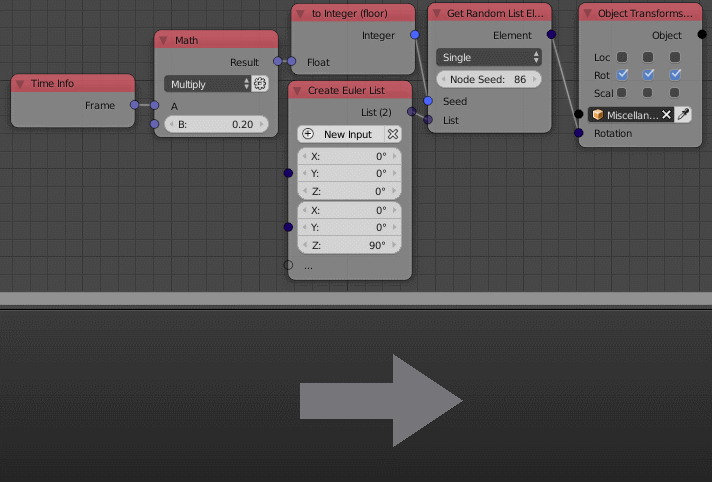

Vector List
===========

Description
-----------
This node is used to create an arbitrary list of eulers. A new euler can be added with the *New Input* button. A new euler can also be added by plugging it into the transperant socket.

.. image:: images/euler_list_node.png
   :width: 160pt
   
Inputs
------
 
- **Euler** - An Euler at the index 0.
- **Euler** - An Euler at the index 1.
- **Euler** - ...

Outputs
-------
- **Euler list** - A list that contain all the input eulers.

Advanced Node Settings
-----------------------

- **Change type** - Change the type of the euler list to another list type.
- **Hide Inputs** - Hide all the inputs in the node.
- **Remove Inputs** - Remove all the inputs.

Caution
-------
A warning pop up when you use the *Remove All* button in the node, while if you used the the *Remove All* button in the *Advanced Node Settings* the inputs will be removed without a warning.

Examples of Usage
-----------------

