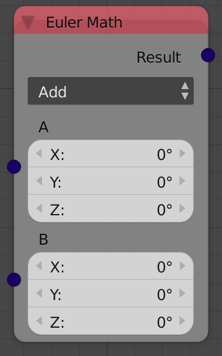
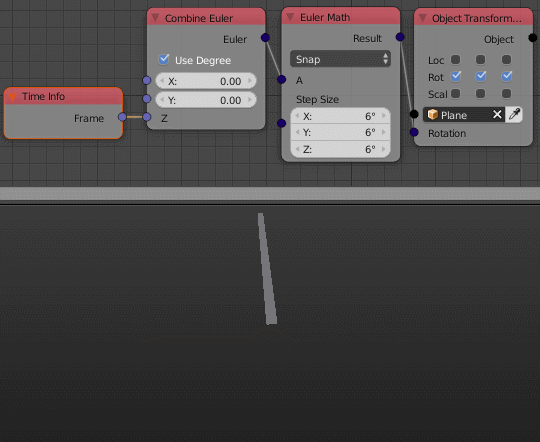

Vector Math
===========

Description
-----------
This node carries 7 euler math operation:

- **Add** - Add corresponding elements of the input eulers.
- **Subtract** - Subtract corresponding elements of the input eulers.
- **Multiply** - Multiply corresponding elements of input eulers.
- **Divide** - Divide corresponding elements of input eulers.
- **Scale** - Multiply all the elements of the input euler by the input *Scale*.
- **Absolute** - Returns the absolute value of the input euler.
- **Snape** - Snape indivitual elements of the input euler to a step size defined for each element by the input *Step Size* euler.

Inputs
------

- **Euler A** - The first euler.
- **Euler B** - The second euler.

(Inputs are dynamic, Means the node has either one or two inputs based on selected operation.Those inputs can also be scalar or eulers based on the operation)

Outputs
-------

- **Result** - The result of euler math operations.

Advanced Node Settings
----------------------

- N/A

Notes
-----

- All of the operations treat eulers in radian.

Examples of Usage
-----------------

