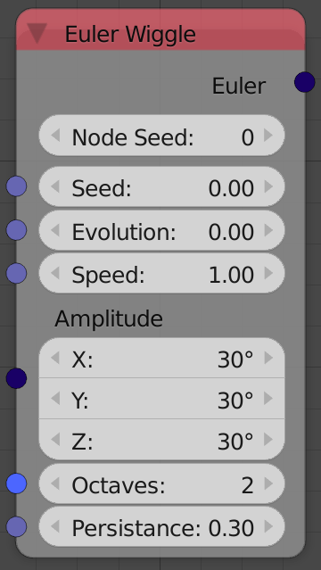
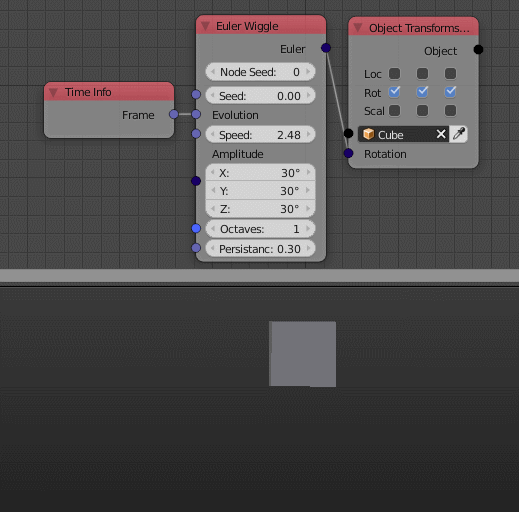

Euler Wiggle
=============

Description
-----------

This node generates a random euler by generating a 1D perlin noise in all of its components.
It is just like a :doc:`Number Wiggle <../number/number_wiggle>` node in the euler's components.

Inputs
------

The inputs are just like :doc:`Number Wiggle <../number/number_wiggle>` node except for the Amplitude.

- **Amplitude** - An euler that controls the the amplitude of each component's perlin noise.

Outputs
-------

- **Euler** - The output euler of the noise functions at the variable **Evolution**.

Advanced Node Settings
----------------------

- N/A

Note
----

The node has an **extra seed** (*Node Seed*) that can be used to differentiate between nodes with the same seed, e.g., When using multiple *Euler Wiggle* nodes in a loop while using the index as a seed, you can change the extra seed to get different results from the other nodes.

Animation Nodes automatically change the *Node Seed* when you duplicate or add a new *Euler Wiggle* node.

Examples of Usage
-----------------

