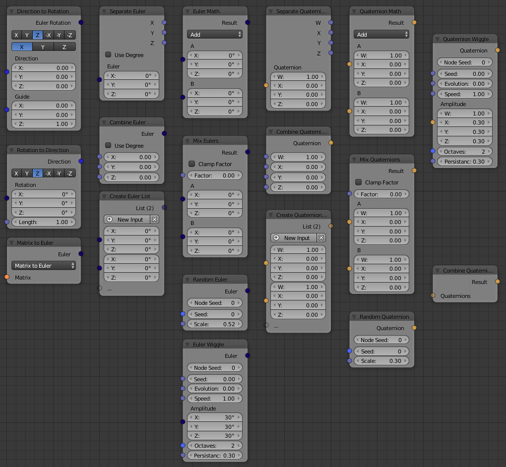

Rotation
========

.. toctree::
    :maxdepth: 1

    Combine Euler <combine_euler>
    Separate Euler <separate_euler>
    Euler List <euler_list>
    Euler Math <euler_math>
    Mix Euler <mix_euler>
    Random Euler <random_euler>
    Euler Wiggle <euler_wiggle>
    Convert Rotation Types <convert_rotation_types>
    Direction to Rotation <direction_to_rotation>
    Rotation to Direction <rotation_to_direction>

