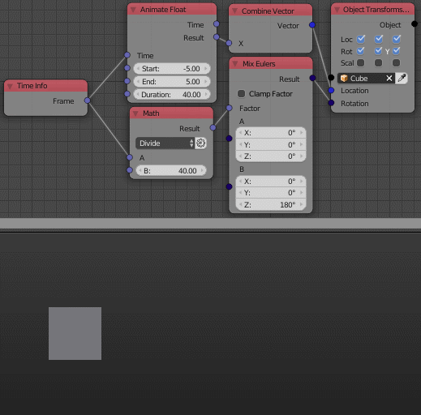

Mix Vectors
===========

Description
-----------

This node mixes between 2 eulers based on a factor.

.. image:: images/mix_euler_node.png
   :width: 160pt

Inputs
------

- **Factor** - A float that controls the amount of each euler input to the output, Where 0 means the first euler only and 1 means the second euler only.

Outputs
-------

- **Result** - The result euler of mixing the two eulers by the input factor.

Advanced Node Settings
----------------------

- N/A

Note
----

The way *Mix Eulers* works, a factor that is larger than 1 won't be clamped but rather multiplied to the second euler. That's why the node has an option to *Clamp Factor*. So if *Clamp factor* is enabled, Any factor that is larger than 1 will return the second euler.

Examples of Usage
-----------------

