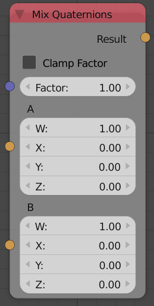
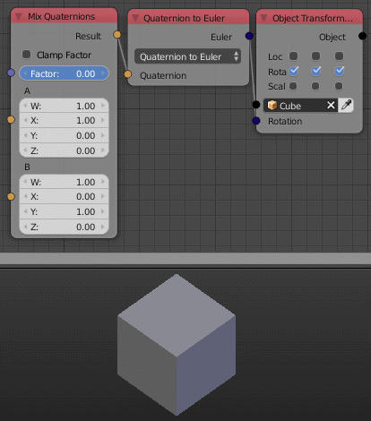

Mix Quaternions
===============

Description
-----------
This node mix between 2 quaternions by a defined factor.

Inputs
------

- **Factor**
    A float that control the amount of each quaternion input to the output,
    where 0 means the first quaternion only and 1 means the second quaternion only.

Outputs
-------

- **Result**
    The result quaternion of mixing the two quaternions by the input factor.

Advanced Node Settings
----------------------

- N/A

Note
----

A factor that is larger than 1 won't be clamped but rather multiplied to the second
quaternion. That's why the node has an option to *Clamp Factor*. So if *Clamp Factor*
is enabled, any factor that is larger than 1 will return the second quaternion.

Examples of Usage
-----------------

