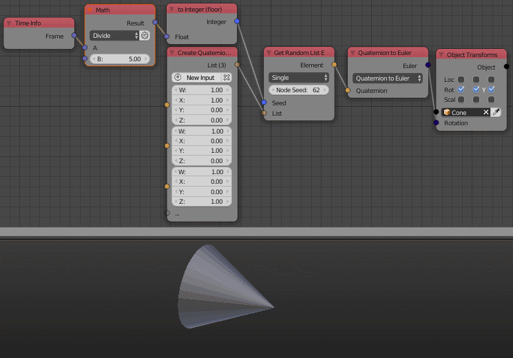

Quaternion List
===============

Description
-----------
This node is used to create an arbitrary list of quaternions. A new quaternion can be added with the *New Input* button. A new quaternion can also be added by plugging it into the transparent socket.

.. image:: images/quaternion_list_node.png
   :width: 160pt

Inputs
------

- **Quaternion** - A quaternion at the index 0.
- **Quaternion** - A quaternion at the index 1.
- **Quaternion** - ...

Outputs
-------
- **Quaternion list** - A list that contain all the input quaternions.

Advanced Node Settings
-----------------------

- **Change type** - Change the type of the quaternion list to another list type.
- **Hide Inputs** - Hide all the inputs in the node.
- **Remove Inputs** - Remove all the inputs.

Caution
-------
A warning pops up when you use the *Remove All* button in the node, while if you used the *Remove All* button in the *Advanced Node Settings* the inputs will be removed without a warning.

Examples of Usage
-----------------

