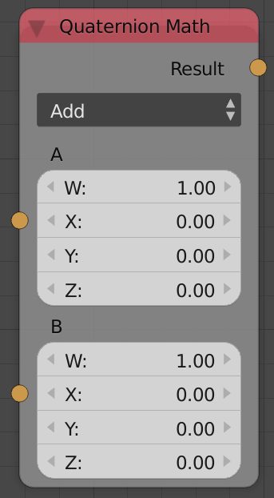

Quaternion Math
===============

Description
-----------
This node carries 13 quaternion math operation:

- **Add** - Adds input quaternion A to input quatrnion B.
- **Subtract** - Subtracts input quaternion B from input quaternion A.
- **Combine Rotation** - Hamilton product of input quaternion A by input quaternion B.
- **Rotation Difference** - Returns a quaternion that is the difference between input quaternion A and input quaternion B.
- **Multiply** - It multiplies the elements of input quaternion A by input quaternion B (element wise operation).
- **Divide** - It divides the elements of input quaternion A by input quaternion B (element wise operation).
- **Cross Product** - Returns a quaternion that is perpendiculat to the input quaternions.
- **Normalize** - Sets the magnitude of the input quaternion to a specific length.
- **Scale** - Perform a scalar multiplication to the input quaternion.
- **Absolute** - Absolute all the components of the input quaternion.
- **Invert** - Multiply the input quaternion by -1.
- **Conjugate** - Multiply the vector part of the quaternion by -1.
- **Snap** - Snaps the components of the input quaternion to a defined step size for each component.




Demonstration
-------------

Quaternion is a system that is used to represent data. It extends the complex number
which is in the form of ``(w+xi)`` where ``w`` is the real part and ``xi`` is the
imaginary part, Quaternions are 4 dimentional in the form of ``(w+xi+yj+zk)`` where
``**``i = j = k = ijk = -1```, As CG artists we tend to think of quaternion as a
real number + a vector ``(w+V)`` where w is a real number and V is a vector.

Quaternions are usually used to represent rotations as an alternative to euler's
angles because it has a smoother interpolation and it has no **Gimball lock**.
Rotations are represented in a form of a **Unit Quaternion** which is a quaternion
that has a length of 1 (``w^2 +x^2 +y^2 +z^2 = 1``), where w is the amount of
rotation around the vector defined by the points (X,Y,Z). Since the magnitude is
always equal to 1, you can think of this vector as a point on a sphere with radius
of 1. Well it is a hypersphere (4D sphere), but for the sake of simplicity we will
just think of it as a sphere.

We said before that the amount of rotation is defined by the real number ``W``.
That angle can be defined in 2 ways:

-  ``θ = 2 Arccos w``
-  ``θ = 2 Arcsine (x^2 +y^2 +z^2) ^ 0.5``

Remember what we said about the quaternion being unit quaternion, we conclude that
``W`` affect ``X,Y,Z`` in the normalization process and that's why it was omitted in
the second equation.


Operations on Quaternion:
-------------------------

- **Addition**
    Adding 2 quaternions is element wise, which means the real part
    is added to the real part and the vector part is added to the vector part.
    Adding 2 unit quaternion will return a non unit quaternion,to be able to use
    this quaternion as a rotation you will have to normalize it, and normalization
    will return unexpected results.
    We conclude that quaternion addition as a rotation model is not that helpful
    because quaternions elements work together and not alone, so elements wise
    operations don't work very well with quaternion.

- **Subtraction**
    Just like adding, Subtraction is element wise and should also
    be normalized to be used as rotations. We also conclude that quaternion
    subtraction as a rotation model is not that useful.

- **Combine Rotation**
    This is what is known as **Hamilton product**, which is
    the way quaternion are multiplied. The multiplication is done based on the rule ``i=j=k=ijk=-1``
    Things get very intersting when it comes to the relatiom between quaternion
    multiplication and rotation, Suppose we have a vector or a point defined as
    ``V = (X,Y,Z)``, we can describe this vector as a quaternion like: ``P = (0,X,Y,Z)``
    and this form is called **Pure quaternion** which is quaterion with the real
    part beign zero. If we want to rotate this point ``P`` by the quaternion ``Q``
    (remember that a quaternion define a rotation around a specific vector by a
    specific amount). All we you have to do is to use the rotation law which state
    that ``P' = QPQ*`` where ``P'`` is the rotated vector, ``P`` the original
    vector (quaternion), ``Q`` is the rotation quaternion and ``Q*`` is the
    conjugate of the rotation quaternion. It is also pretty important to remember
    that quaternion multiplication is not commutative!

- **Rotation Difference**
    If you want to find the difference between 2 quaternion
    you can't use subtraction, because quaternion doesn't work like euler angles.
    Quaternion provided us with another way to get the difference between 2 quaternions though.
    This Quaternion is defined as ``Q = Q2 * conj(Q1)`` where ``Q`` is the difference
    quaternion, ``Conj(Q1)`` is the conjugate of ``Q1``. It is also important to
    remember that this process is not commutative because it include quaternion multiplication.

- **Multiply**
    This is element wise multiplication. It is also not very useful as a rotation model.

- **Divide**
    just as multiplication, it is an element wise operation and not very useful as rotation model.

- **Cross Product**
    Cross product is where things get interesting, because
    the cross product of 2 quaternions is pretty much a Hamilton Product.
    In fact we can express quaterniom multiplication using Cross Product.

- **Normalization**
    This operation just set the length of the quaternion to a
    specific length, and it doesn't change that quaternion in terms of it's
    representation of rotations,because the quaternion still maintain its direction
    in the 4D space and when used as rotation,it get normalized and stay the same.

- **Scale**
    Just like normalize but it multiplies the current length by a factor.

- **Absolute**
    It Absolutes all the elements of the quaternion.

- **Invert**
    Multiplies all the elements of the quaternion by -1.

- **Conjugate**
    The conjugate of the quaternion ``w+xi+yj+zk = w-xi-yj-zk``.
    Notice that the real part didn't change. We used the conjugate in the Rotation
    difference and Quaternion Rotation if you remember.

- **Snap**
    Snap the individual elements to a specific step size. Put in mind
    that quaternion rotation is not linear, so you may not get what you want out of quaternion.

Inputs
------

- **Quaternion A** - The first quaternion.
- **Quaternion B** - The second quaternion.

(Inputs are dynamic, Means the node has either one or two inputs based on selected
operation. Those inputs can also be scalar or quaternion based on the operation)

Outputs
-------

- **Result** - The result of quaternion math operations.

Advanced Node Settings
----------------------

- N/A

Examples Of Usages
------------------

.. image:: gifs/quaternion_math_node_example.gif
