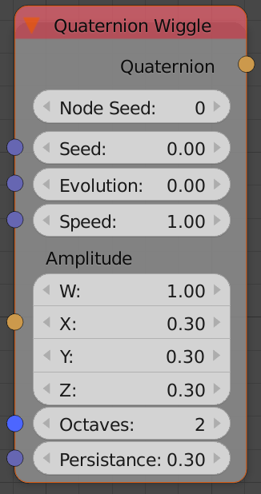
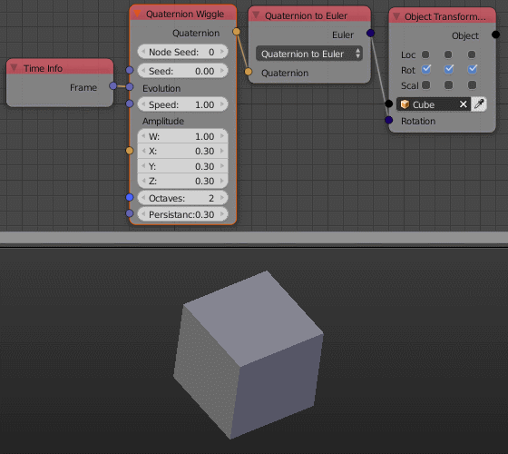

Quaternion Wiggle
=================

Description
-----------
This node generate a random quaternion by generating a 1D perlin noise in all of it's components.
It is just like a :doc:`Number Wiggle <../number/number_wiggle>` node in the quaternion's components.

Inputs
------

The inputs are just like :doc:`Number Wiggle <../number/number_wiggle>` node except for the Amplitude.

- **Amplitude** - A quaternion that control the the amplitude of each component's perlin noise.

Outputs
-------

- **Quaternion** - The output quaternion of the noise functions at the variable **Evolution**.

Advanced Node Settings
----------------------

- N/A

Note
----

The node has an **extra seed** (*Node Seed*) that can be used to differentiate
between nodes with the same seed. e.g. when using multiple *Quaternion Wiggle*
nodes in a loop while using the index as a seed, you can change the extra seed
to get different results from the other nodes.

Animation Nodes automatically change the *Node Seed* when you duplicate or add a
new *Quaternion Wiggle* node.

Examples of Usage
-----------------

